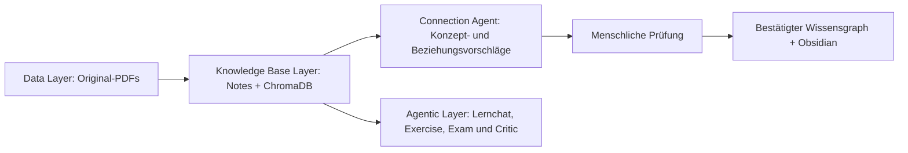

# AI Learning Companion

Lokales MVP eines universitären Studienprojekts: Der AI Learning Companion macht eigene PDF-Unterlagen als persönliche Wissensbasis nutzbar. Er beantwortet Lernfragen mit Quellen, erstellt Übungen und Probeklausuren und speichert Chats sowie generierte Inhalte für spätere Sitzungen.

## Architektur



- **Data Layer** (`src/data_layer`, `user_data`): PDFs speichern, SHA-256-Duplikate erkennen und Text mit PyMuPDF lesen.
- **Knowledge Base Layer** (`src/knowledge_layer`, `knowledge_base`): Inhalte thematisch extrahieren und als Markdown-Notes mit YAML-Metadaten speichern und semantisch durchsuchen.
- **Agentic Reasoning / Analytics Layer** (`src/agent_layer`): Lernchat, Exercise, Exam, Critic und Connection Agent greifen über Retrieval beziehungsweise belegte Notes und `LLMService` auf Wissen und Modelle zu.

SQLite (`src/persistence`) speichert Chats, Dokumente, Notes-Übersicht sowie den bestätigten Second-Brain-Graph und die Review-Historie. `src/llm` kapselt beide Anbieter hinter `LLMService`. Markdown bleibt die Wissensrepräsentation der Notes; der kuratierte Graph wird zusätzlich als Obsidian-kompatible Markdown-Dateien exportiert.

## Voraussetzungen, Installation und Start

Benötigt werden Windows, Python 3.10 oder neuer mit pip (empfohlen: Python 3.12) und ein API-Key für OpenAI oder Google Gemini. Das Repository über GitHub herunterladen oder mit `git clone --branch Neuste_Version_01_10 https://github.com/LucaSp260/Studienprojekt_Steffen_Luca.git` klonen. Anschließend unter Windows zuerst `setup.bat`, danach `start.bat` doppelt anklicken. Das Setup prüft Python, erstellt `.venv`, installiert alle Abhängigkeiten und initialisiert die lokalen Ordner sowie SQLite. Bereits eingerichtete Umgebungen lassen sich durch erneutes Ausführen von `setup.bat` aktualisieren. Falls der Browser nicht öffnet: http://localhost:8501. Zum Beenden im Terminal Strg+C drücken.

Ein eigener Python-Pfad kann mit `setup.bat "C:\Pfad\zu\python.exe"` gewählt werden. Die vorhandene `.venv` verwendet Python 3.12 aus der lokalen Codex-Runtime; nach deren Entfernung die Umgebung mit einer eigenen Python-Installation neu einrichten.

## Ein PDF in die Wissensbasis übernehmen

1. Unter **Einstellungen** OpenAI oder Google Gemini wählen, API-Key und Modellname angeben. **Speichern** übernimmt die Auswahl; **Verbindung testen** führt eine kurze echte Modellanfrage aus.
2. Unter **Unterlagen** einen Kurs eingeben, PDFs auswählen und **Unterlagen hinzufügen** klicken.
3. Unter **Wissensbasis** beim gewünschten PDF **In Wissensbasis verarbeiten** anklicken. Der Fortschritt zeigt die bearbeiteten Abschnitte.
4. Danach ein Thema öffnen: Inhalt, Tags, Schwierigkeit, Originaldatei und Quellseiten werden ohne YAML-Syntax angezeigt.

Bei der Verarbeitung wird der extrahierte PDF-Text an den gewählten Anbieter gesendet. API-Aufrufe können Kosten verursachen. Sie erfolgen ausschließlich beim Verbindungstest oder durch eine ausdrücklich ausgelöste Verarbeitung, Indexierung, Suche, Lernfrage oder Generierung. Navigation, das Öffnen alter Chats und normale Streamlit-Neuläufe senden keine Anfrage. Bereits verarbeitete PDFs werden nicht erneut verarbeitet; Reprocessing ist nicht enthalten.

## Second Brain und Wissensatlas

1. Verarbeite zuerst PDF-Unterlagen zu Knowledge Notes.
2. Nach erfolgreicher Indexierung erweitert die App den Atlas automatisch: Neue Notes werden miteinander und mit höchstens fünf semantisch relevanten alten Notes je neuer Note verglichen. Insgesamt gelangen höchstens zwölf alte Notes in den Connection-Agent-Kontext. Bestehende Konzepte und Beziehungen werden nicht neu erzeugt. Dieser Schritt kann zusätzliche API-Kosten verursachen.
3. Öffne **Second Brain**. Die Gesamtansicht zeigt alle Konzepte und Beziehungen ohne Kantenlabels; ein Schalter blendet sie ein. Die Fokusansicht zeigt ein auswählbares Konzept und seine Nachbarn über einen oder zwei Hops mit direkt sichtbaren Beziehungskategorien. Hover/Klick zeigt Begründung, Belege, Herkunft und Review-Status.
4. Automatisch ergänzte Beziehungen sind **KI-generiert** und sofort sichtbar. Bestehende übernommene und manuelle Beziehungen bleiben **Nutzerbestätigt**. Beziehungen lassen sich später bearbeiten oder löschen; das Speichern einer Bearbeitung bestätigt die betreffende KI-Kante. Der bisherige Button **Verbindungen mit dem Agenten vorschlagen** bleibt für eine bewusst manuell ausgelöste Analyse mit anschließender Vorschlagsprüfung verfügbar.
5. Unter **In Obsidian öffnen → Obsidian-Export aktualisieren** entsteht ein kursbezogener Vault unter `knowledge_base/Second Brain/`. Exportierte Beziehungen tragen ihren Status im Markdown. Öffne den angezeigten Ordner in Obsidian als Vault und nutze **Graph View**.

Obsidian ist eine Visualisierung und externe Lesekopie. Die App bleibt die führende Wissensbasis. Offene und abgelehnte Vorschläge werden nicht als Verbindungen exportiert. Änderungen in Obsidian werden nicht in die App zurückimportiert.

Der Streamlit-Atlas zeigt zunächst ein Konzept und seine direkten Nachbarn. Über **Graph-Fokus** kann ein anderes Konzept oder der gesamte Atlas gewählt werden. Mausrad und Schaltflächen zoomen; Ziehen verschiebt den Graphen oder einzelne Knoten. Hover und Klick zeigen Quellen, Beschreibung und Begründung. **Beleg-Notes im Graphen anzeigen** ergänzt orange Note-Knoten zu den blauen Konzepten. Frühere Beziehungen behalten ihren ursprünglichen Typ; ihre bisherige Begründung steht zusätzlich als Beschreibung bereit, bis sie fachlich präzisiert werden.

Die Review-Historie vergleicht den ursprünglichen Agentenvorschlag mit der übernommenen Fassung und zählt unveränderte Übernahmen, Anpassungen und Ablehnungen. Diese Kennzahlen zeigen menschliche Korrekturarbeit, aber ohne fachlich gelabelten Referenzdatensatz keine objektive Wahrheitsquote.

## Anbieter und lokale Einstellungen

Die Standardmodelle sind zentral in `src/llm/config.py` hinterlegt: OpenAI `gpt-5.6-luna` und Gemini `gemini-3.8-flash`. Der Modellname kann in der UI geändert werden; das gewählte Modell muss strukturierte Ausgaben unterstützen.

Konfiguration und Schlüssel liegen lokal in `.env`, nicht in SQLite. `.env` ist eine lokale Klartextdatei und von Git ausgeschlossen; sie sollte privat bleiben. Bereits gespeicherte Schlüssel werden nicht in das UI-Feld zurückgeladen. Ein leeres Feld behält den vorhandenen Schlüssel. Alternativ werden `OPENAI_API_KEY` beziehungsweise `GEMINI_API_KEY` aus der Prozessumgebung gelesen. `.env.example` dokumentiert alle Variablen. Eine Modelländerung oder ein Verbindungstest allein speichert noch keine Einstellungen.

Die Implementierung folgt den offiziellen SDKs und Dokumentationen: [OpenAI Structured Outputs](https://developers.openai.com/api/docs/guides/structured-outputs), [OpenAI-Modell](https://developers.openai.com/api/docs/models/gpt-5.6-luna) und [Gemini Structured Outputs](https://ai.google.dev/gemini-api/docs/structured-output). OpenAI verwendet die Responses API, Gemini die Interactions API. Beide liefern schemaabhängiges JSON; Pydantic validiert es nochmals lokal.

## Verarbeitung und Persistenz

- Originale bleiben unter `user_data/<kurs>/`. Identischer Inhalt wird kursübergreifend nur einmal gespeichert, auch unter anderem Dateinamen. Gleichnamige Dateien mit anderem Inhalt erhalten einen nummerierten Namen.
- Chunking gruppiert maximal sechs Seiten und 16.000 Zeichen Quelltext pro Abschnitt. Überlange Seiten werden weiter geteilt und behalten ihre Seitennummer. Seitenangaben beziehen sich auf die physische PDF-Seite (beginnend bei 1), nicht auf eventuell abweichende aufgedruckte Seitenzahlen.
- Das Modell erzeugt thematische Notes statt einer Note pro Seite. Bereits erkannte Titel werden für einheitliche Bezeichnungen mitgegeben. Gleiche normalisierte Titel werden lokal zusammengeführt; Quellen und Inhalte bleiben dabei erhalten. Eine vollständige semantische Erkennung aller Synonyme ist nicht enthalten.
- Python prüft Pflichtfelder, Schwierigkeit, Tags und Seitenzahlen. Quellseiten müssen im jeweiligen Textabschnitt liegen. Kurs und Originaldateiname werden aus SQLite übernommen. Fachliche Richtigkeit und die genaue inhaltliche Zuordnung sollten anhand der angegebenen Quelle geprüft werden.
- Notes liegen in `knowledge_base/<kurs>/*.md`, mit Titel, Kurs, Thema, Tags, Schwierigkeit, Quelle, Seiten und verwandten Themen im YAML-Frontmatter. SQLite registriert sie in `knowledge_notes` mit Dokumentbezug und relativem Markdown-Pfad.
- Für neue Dokumente wird `documents.processed = 1` erst nach Markdown, SQLite und erfolgreicher Indexierung gesetzt. Schreibfehler vor dem SQLite-Commit werden zurückgenommen. Bei späteren Embedding-/Chroma-Fehlern bleiben die Notes erhalten, das Dokument bleibt unverarbeitet. Der nächste Versuch indexiert die vorhandenen Notes ohne erneute Knowledge Extraction. PDFs ohne Text können gespeichert, aber ohne OCR nicht in Notes umgewandelt werden.
- `brain_note_processing` merkt sich abgeschlossene Connection-Analysen. Bei der einmaligen Migration werden vorhandene Notes als Bestand markiert, damit sie nicht nachträglich kostenpflichtig analysiert werden. Scheitert nur der Connection-Schritt, bleiben die indexierten Notes erhalten und er kann unter **Bereits verarbeitete Dokumente** ohne neue Extraction erneut gestartet werden. `brain_edges.review_status` unterscheidet KI-generierte von nutzerbestätigten Beziehungen; `llm_usage` speichert Anbieter, Modell, Operation, Zeitpunkt und nur tatsächlich gelieferte Tokenwerte.

Datenbank und fehlende Tabellen werden beim Start automatisch angelegt, bestehende Daten bleiben erhalten. PDFs, Chats und Notes überstehen normale Neustarts. Die Anwendung ist für eine lokale Streamlit-Instanz vorgesehen; eine Verarbeitungssperre schützt vor gleichzeitigen Klicks in deren Browsersitzungen. Ein harter Prozessabbruch während des Schreibens kann unregistrierte Markdown-Dateien zurücklassen; bestehende Dateien werden auch dann nicht überschrieben. Zeitstempel in SQLite sind UTC.

Beim Neustart wird der zuletzt aktualisierte Chat samt gespeicherter Antworten und Quellen geladen; ältere Chats bleiben auswählbar.

## Lernchat

Unter **Lernen → Lernchat** lassen sich Fragen zur persönlichen Wissensbasis stellen. Optional begrenzt ein Kursfilter die Suche. Der Chat ruft passende Notes über dasselbe semantische Retrieval wie die Wissensbasis-Suche ab, gibt dem Modell nur diese Inhalte und zeigt an jeder Antwort die tatsächlich verwendeten PDF-Dateien und Seiten. Eine Antwort ohne belegte Quelle wird nicht als wissensbasierte Antwort ausgegeben. Wenn die Wissensbasis nicht genügend Inhalt liefert, meldet der Chat das offen.

Kurze Anschlussfragen berücksichtigen höchstens die sechs letzten Nachrichten als Gesprächskontext. Dieser Kontext hilft bei der Auflösung von Bezügen; die Antwort muss weiterhin durch neu abgerufene Notes gedeckt sein. Frage, Antwort, Kursfilter und Quellen werden gemeinsam in SQLite gespeichert. Alte Chats können deshalb nach einem Neustart ohne LLM- oder Embedding-Aufruf gelesen werden.

## Übungen, Probeklausuren und Critic Agent

Unter **Lernen** stehen neben dem Lernchat drei Bereiche zur Verfügung: **Übungen erstellen**, **Probeklausur erstellen** und **Meine Inhalte**. Eine Generierung beginnt ausschließlich über den jeweiligen Formular-Button.

Der Ablauf ist bewusst klein und nachvollziehbar:

```text
Retrieval → Generator → Critic → gegebenenfalls eine Revision → Final
```

- Der **Exercise Agent** bildet aus Kurs, Thema, Anzahl, Schwierigkeit und Aufgabentyp eine Retrieval-Anfrage. Er verwendet standardmäßig höchstens fünf Notes und erzeugt Aufgaben mit Musterlösung, Erklärung und Quellen.
- Der **Exam Agent** erstellt aus mehreren gefundenen Notes eine Probeklausur mit Punkten und Lösungen. Bei gemischter Schwierigkeit verteilt eine lokale Funktion ungefähr 20 % leicht, 50 % mittel und 30 % schwer nach dem Verfahren des größten Rests. Eine getrennte Zeitheuristik bewertet Aufgabentyp, Schwierigkeit, Teilaufgaben, Text- und Antwortumfang, Begründungs- und Transferanteil; Punkte wirken nur als kleiner zusätzlicher Faktor. Die Zeiten werden nicht auf die Wunschdauer skaliert. Der Generator und die einzige mögliche Critic-Revision müssen den tatsächlichen Aufgabenumfang in einen Zielbereich von ungefähr ±7 % bringen.
- Der **Critic Agent** prüft Grounding, Lösung, Klarheit, Schwierigkeit, Redundanz und Quellen. Bei Klausuren prüft er zusätzlich Vielfalt, Punkte, Einzelzeiten und Gesamtdauer. Ist eine Klausur zu kurz oder zu lang, muss die Revision Aufgaben oder Teilfragen fachlich erweitern beziehungsweise kürzen. Er darf höchstens eine vollständig überarbeitete Fassung liefern; es gibt keine Agentenschleife. Schlägt die Prüfung fehl, wird der Entwurf sichtbar als ungeprüft markiert.

Aufgaben besitzen optional strukturierte Teilaufgaben. Jede Teilaufgabe, Kurzantwort und Erklärung trägt dieselbe ID, zum Beispiel `a`, `b`, `c` oder `1`, `2`, `3`. Pydantic verwirft Ergebnisse, wenn IDs oder Reihenfolge zwischen `subtasks`, `short_answer_items` und `explanation_items` abweichen. Die UI zeigt jedes Element in einem eigenen Absatz. Bei Aufgaben ohne Teilaufgaben bleiben `solution` und `explanation` die beiden Lösungsebenen. Alte Artefakte ohne die neuen Listen bleiben über diese bisherigen Felder lesbar.

Vor dem Modellaufruf erhalten Retrieval-Treffer lokale IDs wie `SOURCE_1`. Das Modell darf nur diese IDs verwenden. Python validiert jede ID und übersetzt sie für die Anzeige in den tatsächlichen PDF-Dateinamen und die Seiten der gefundenen Knowledge Note. Ungültige oder erfundene IDs führen zu einem Fehler.

Das ist mehr als ein einzelner LLM-Prompt: Die Inhalte stammen aus der persistenten persönlichen Knowledge Base, werden gezielt semantisch abgerufen, auf diese Quellen begrenzt, strukturiert validiert und anschließend durch einen spezialisierten zweiten Agenten geprüft. Fertige Übungen und Klausuren liegen als JSON in SQLite in `generated_artifacts` und können unter **Meine Inhalte** nach einem Neustart ohne API-Aufruf wieder geöffnet werden.

## Semantische Suche

1. Unter **Einstellungen** das separate **Embedding-Modell** prüfen und speichern. Das vorhandene LLM `gpt-5.6-luna` bleibt für Textgenerierung zuständig.
2. Auf **Wissensbasis** einmal **Vorhandene Themen indexieren** klicken. Bestehende Notes werden aus Markdown gelesen, nicht neu durch ein LLM erzeugt. Unveränderte Einträge werden übersprungen; geänderte Dateien werden beim expliziten Indexieren aktualisiert.
3. Unter **Wissensbasis durchsuchen** eine Frage eingeben, optional einen Kurs wählen und **Suchen** anklicken. Standardmäßig erscheinen die fünf ähnlichsten Notes (`top_k=5`), bei weniger passenden Einträgen entsprechend weniger. Quellen und physische PDF-Seiten bleiben sichtbar. Die Reihenfolge basiert auf Kosinusdistanz, nicht auf erfundenen Prozentwerten.

Standards in `src/llm/config.py`: OpenAI `text-embedding-3-small`, Gemini `gemini-embedding-2`, jeweils 768 Dimensionen. `.env` speichert `OPENAI_EMBEDDING_MODEL` und `GEMINI_EMBEDDING_MODEL` getrennt von den LLM-Modellen. Anbieter und Key werden aus der vorhandenen Konfiguration übernommen. Der Button **Verbindung testen** prüft weiterhin nur das LLM.

Der Suchtext enthält Titel, Thema, Tags und den fachlichen Markdown-Inhalt, keine technischen YAML-Felder. Sehr lange Notes werden in Abschnitte von höchstens 6.000 UTF-8-Bytes eingebettet; deren längengewichtetes Mittel ergibt einen normalisierten Vektor je Note. Es wird kein Inhalt still abgeschnitten.

**SQLite** verwaltet Chats, Dokumentstatus und Note-Zuordnung. **Markdown** bleibt die vollständige Wissensrepräsentation. **ChromaDB** speichert nur Suchvektoren und Metadaten lokal unter `chroma_db/`, ohne externen Server oder Cloud-Account. ChromaDB ist Infrastruktur des Knowledge Base Layers, kein zusätzlicher fachlicher Layer. Der Ordner bleibt von Git ausgeschlossen.

Jede Kombination aus Provider, Embedding-Modell, Dimension und Indexformat erhält eine eigene Collection. Stabile IDs wie `knowledge_note_7` und Upserts verhindern Duplikate. Nach Modellwechsel **Vorhandene Themen indexieren** erneut ausführen; der frühere Index bleibt erhalten. Der Dokumentstatus dokumentiert eine abgeschlossene Verarbeitung; die Suchabdeckung ist vom aktuell gewählten Modell abhängig. App-Start und Streamlit-Neuläufe lösen keine Embedding-Anfragen aus.

Technische Quellen: [OpenAI Embeddings](https://developers.openai.com/api/docs/guides/embeddings), [Gemini Embeddings](https://ai.google.dev/gemini-api/docs/embeddings), [Chroma Collections](https://docs.trychroma.com/docs/collections/manage-collections).

## Datenschutz und lokale Daten

PDFs, Markdown-Notes, SQLite-Daten, Chroma-Vektoren und API-Konfiguration liegen lokal in den Ordnern `user_data/`, `knowledge_base/`, `chroma_db/`, `data/` beziehungsweise in `.env`. Diese Pfade und Python-Umgebungen sind in `.gitignore` ausgeschlossen. API-Keys werden nicht in SQLite oder in generierten Inhalten gespeichert.

Das Projekt arbeitet nicht vollständig offline: Für Extraktion, Embeddings, Lernchat, Übungen und Klausuren werden die jeweils nötigen Inhalte an den gewählten Anbieter OpenAI oder Google Gemini übertragen. Welche Daten dabei verarbeitet werden, richtet sich zusätzlich nach den Bedingungen und Einstellungen des Anbieters. Vor einer Weitergabe des Projekts sollten `.env` und alle lokalen Datenordner privat bleiben.

## Warum nicht einfach ein PDF in ChatGPT laden?

Der Companion verwaltet mehrere Unterlagen dauerhaft als eigene, lokal nachvollziehbare Wissensbasis. Er erkennt bereits verarbeitete Dokumente, hält Quellen bis auf PDF-Seitenebene fest, sucht kursübergreifend oder mit Kursfilter und speichert Antworten zusammen mit den konkret verwendeten Quellen. Übungen und Klausuren verwenden dieselbe Wissensbasis, validieren ihre strukturierte Ausgabe und lassen einen getrennten Critic Agent genau eine Qualitätsprüfung durchführen. Dadurch bleibt der Ablauf reproduzierbarer als ein einzelner, isolierter Datei-Chat.

## Bekannte Grenzen

- Gescannte PDFs benötigen OCR; diese Funktion ist nicht enthalten.
- Antworten und generierte Aufgaben können trotz Quellenbindung fachliche Fehler enthalten. Quellen sollten bei wichtigen Aussagen geprüft werden.
- Die Seitennummer bezeichnet die physische PDF-Seite und kann von einer aufgedruckten Nummer abweichen.
- Knowledge Extraction, Embeddings und Modellantworten können API-Kosten verursachen.
- Gleichartige Themen werden anhand normalisierter Titel zusammengeführt; eine vollständige semantische Synonymerkennung ist nicht enthalten.
- Die Anwendung ist als lokales Studienprojekt für eine einzelne Person ausgelegt, nicht als Mehrbenutzersystem.

## Tests

Kostenfrei und ohne persönliche Unterlagen:

```text
.venv\Scripts\python.exe -m unittest discover -s tests -v
```

Die Suite erzeugt temporäre PDFs und Datenbanken. Sie prüft Upload, Duplikate, Chat-Persistenz einschließlich Quellen, begrenzten Anschlusskontext, Navigation ohne API-Aufruf, Migrationen, Chunking, Quellenvalidierung, JSON/YAML/Markdown, Fehler-Rollback, Konfiguration, Setup-Skripte und UI-Neustarts mit Mock-LLM. Suchtests verwenden echte temporäre Chroma-Dateien mit Mock-Embeddings. Agent-Tests mocken Retrieval und LLM und prüfen Anzahl, Schwierigkeit, Lösungen, Source-IDs, Vielfalt, Punkte, Dauer, eine einzelne Revision, Fehlerbehandlung und Artefakt-Persistenz.

Optionaler echter API-Test (kann Kosten verursachen):

```text
.venv\Scripts\python.exe tests/manual_api_check.py
```

Dieser Test nutzt ausschließlich eine selbst erzeugte kleine PDF, einen vorhandenen Schlüssel und temporäre Dateien. Ohne Schlüssel wird er übersprungen.

Ein expliziter echter Retrieval-Test für die vorhandenen Notes (OpenAI, kostenpflichtige API-Aufrufe) ist ebenfalls verfügbar:

```text
.venv\Scripts\python.exe tests/manual_retrieval_check.py
```

Er indexiert die vorhandenen Notes ohne Knowledge Extraction, prüft beide EAM-Testanfragen sowie einen neuen Prozess und kontrolliert, dass die Markdown-Dateien unverändert bleiben. Ergebnisse liegen in `chroma_db/retrieval_test_report.json`.

Die zwei kleinen echten Phase-5-Szenarien aus der Aufgabenbeschreibung lassen sich separat starten:

```text
.venv\Scripts\python.exe tests/manual_agent_check.py
```

Der Lauf verwendet die vorhandene SWA-Wissensbasis, erzeugt zwei Übungen und eine 30-minütige Probeklausur, speichert beide Artefakte und lädt sie in einem neuen Python-Prozess erneut. Er führt zwei Embedding-Anfragen sowie je einen Generator- und Critic-Aufruf pro Artefakt aus und kann API-Kosten verursachen.

Der kleine echte Phase-6-Check stellt eine Hauptfrage und eine Anschlussfrage an die vorhandene Wissensbasis, speichert beide Antworten mit Quellen und prüft sie nach einem Prozessneustart:

```text
.venv\Scripts\python.exe tests/manual_chat_check.py
```

Der Lauf verursacht je Frage genau einen Retrieval- und einen LLM-Aufruf. Vorhandene PDFs, Notes, Übungen und Klausuren werden nur gelesen und nicht erneut erzeugt.
